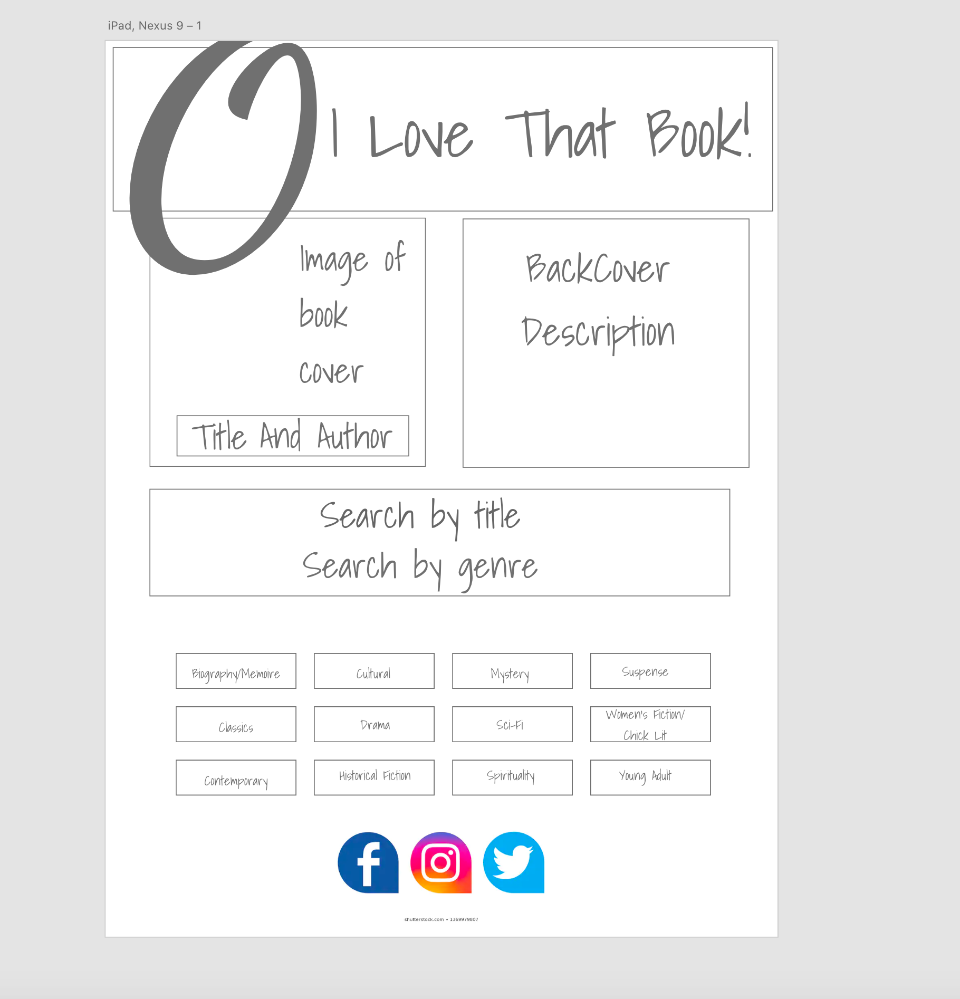
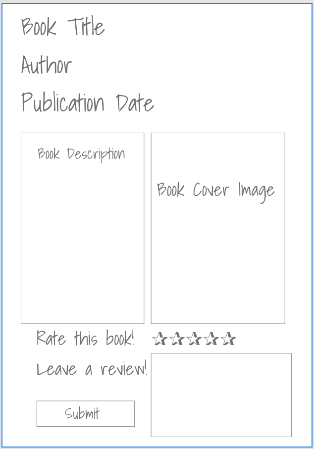
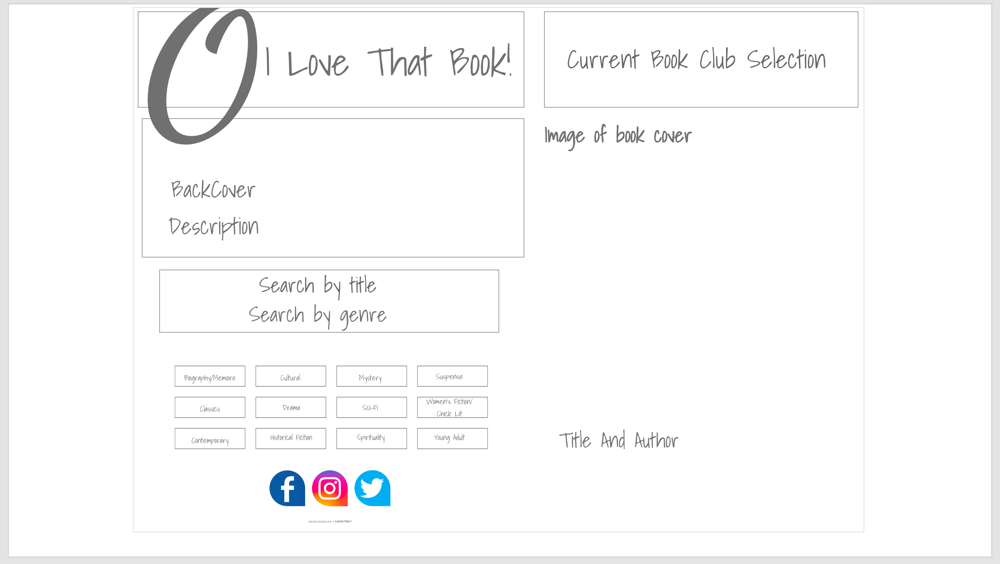
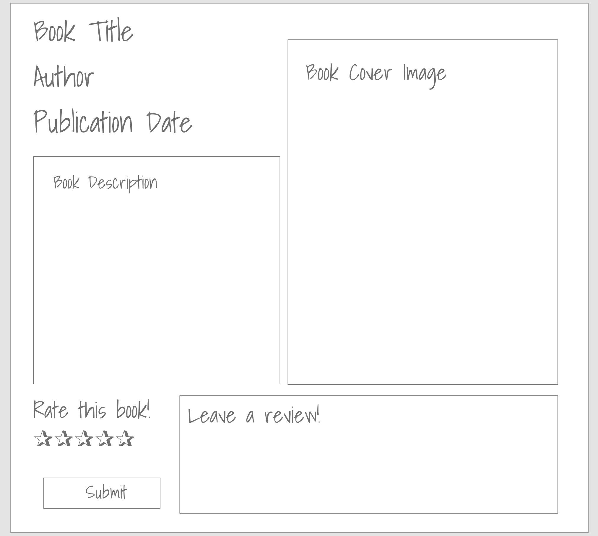
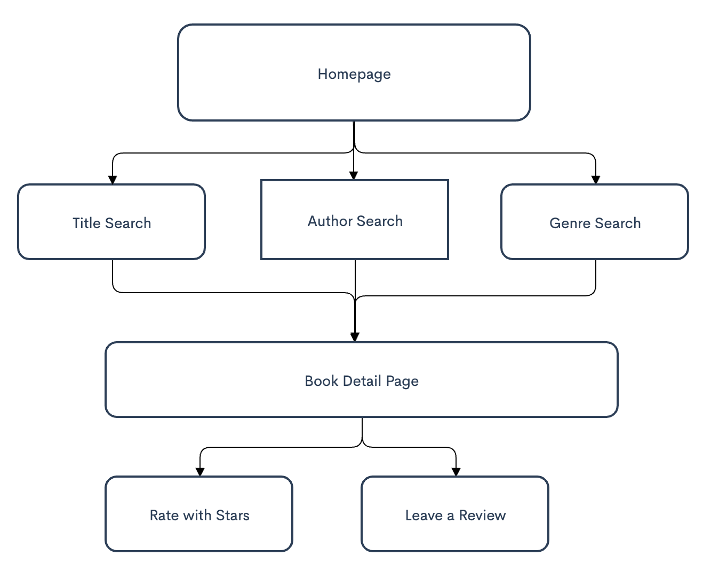

1. **Title:** O I Love That Book!
2. **Description:** 
O I Love That Book will contain all of the books on Oprah's Book Club Book List.  When a use opens the app, they will see the cover and description of the current book club book.  They will also be able to search by title, author or genre for the other books on the list.  When searching by author or title, the user will be routed to the book detail page.  If the user searches by genre using the genre buttons, they will be taken to a list of books in that genre.  They can then click on the title and will be taken to the book detail page.  On the detail page the user will see the book cover image, the title, author and description of the book.  They will also be able to rate the book using the 1-5 star system or can write a detailed review.
3. **Wireframes:** 

Tablet View




Desktop View



4. **Component Hierarchy:** 



5. **API:** EXAMPLE RESPONSE


```{
    "records": [
        {
            "id": "recYGQ3IeTXa34uI5",
            "fields": {
                "title": "The Deep End of the Ocean",
                "author": "Jacquelyn Mitchard",
                "description": "Both highly suspenseful and deeply moving, The Deep End of the Ocean imagines every mother's worst nightmare—the disappearance of a child—as it explor...",
                "year published": "1999",
                "genre": [
                    "Mystery"
                ]
            },
            "createdTime": "2020-12-03T16:40:54.000Z"
        },```

6. **MVP:** 
Homepage with 2 search fields that route to book details page
Homepage with buttons to  select the book by genre
Get and post book info from Airtable
Create a form for the user to leave a review

7. **Post-MVP:** 
Get and post reviews from a book review source
Search feature where the user can find an online book club to join

8. **Project Schedule:** 
| Proposal due              | 12/04/20 |     
| Deployed MVP              | 12/10/20 |     
| Presentation              | 12/11/20 |      

9. **Timeframes:** 
| Component                 | Priority | Estimated Time | Time Invested | Actual Time |
| ------------------------- | :------: | :------------: | :-----------: | :---------: |
| Proposal                  |    H     |      6hrs      |     6hrs      |    6hrs     |
| Airtable setup            |    H     |      6hrs      |     9hrs      |    9hrs     |
| Data population home      |    H     |      6hrs      |     9hrs      |    9hrs     |
| Data population detail pg |    H     |      6hrs      |     9hrs      |    9hrs     |
| Create Form for Review    |    H     |      2hrs      |     2hrs      |    2hrs     |
| Set up star review        |    H     |      2hrs      |     -hrs      |    -hrs     |
| Homepage css              |    H     |      5hrs      |     8hrs      |    8hrs     |
| Detail page css           |    H     |      5hrs      |     7hrs      |    7hrs     |
| Total                     |    H     |      38hrs     |    58hrs      |   58hrs     |

10. **SWOT Analysis:** 
Strengths: I have a solid and detailed plan how to create the app 
Weaknesses: I am really weak on css so I am concerned the styling will be rudimentary Opportunities: I'm excited to use the skills I've learned in the past few weeks.  I think this is a chance for me to grow in understanding how and when to use the things React has to offer.
Threats: When I get stuck in an error or can't recall how to make a function work, I tend to freeze then panic.  I will be mindful to ask for help when these things come up.
